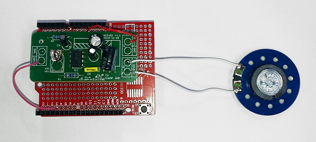
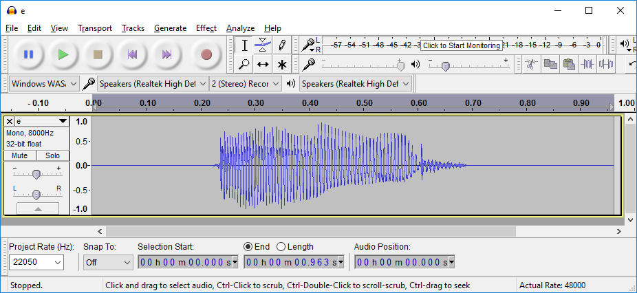

## Ultrasonic Theremin

The Ultrasonic Theremin plays back samples, but modulates them depending on the distance from your hand to the ultrasonic sensor, giving an effect similar to a traditional Theremin. This simple project doesn't need many parts to get its sound because it uses a few of the special hardware features of the ATMEGA 328p chip in the Uno to do most of the work. Because of this, you can't use a Leonardo or a Mega (but the Nano does use the same chip as the Uno, so it could replace the Uno). There is some soldering needed to complete this project.


## Shopping List:

|Qty| Code | Description |
|---|---|---|
|1 | [XC4410](http://jaycar.com.au/p/XC4410) | Uno main board
|1 | [AA0373](http://jaycar.com.au/p/AA0373) | Mono amplifier Module
|1 | [XC4482](http://jaycar.com.au/p/XC4482) | Prototyping shield
|1 | [AS3004](http://jaycar.com.au/p/AS3004) | 40mm Speaker
|1 | [XC4442](http://jaycar.com.au/p/XC4442) | Ultrasonic sensor

## Construction:

Most of the construction involves the mounting of the Amplifier Module on the Prototyping Shield to create a tidy arrangement of part, but firstly, you'll have to remove the module from its case by gently prying the two halves apart, and then prying the board out of the case. All the wires can be desoldered and put aside for later.


You can then attach some short pieces of stiff wire (about 1cm should be enough) to the underside of the two GND pads and the SPKR- pad. These are for mounting the module. Attach some lengths of insulated wire to the remaining pads (they'll be hard to get to after the board has been mounted). I used red for the +4-12V pad, pink for the INPUT pad, and white for the SPKR+ pad. You should also attach another wire to the SPKR- pad.


Next, mount the module on the Prototyping shield by lining up the two GND pins at one end with the GND connection on the shield- this holds the module firm and provides all the ground connections. Solder these wires in place so that there is a bit of a gap between the module and shield.


Then solder the single wire at the other end in place to an isolated hole- it doesn't need to go anywhere, because all the ground connections are made through the amplifier module.


Now we attach the other ends of the leads to the shield and to the speaker. These are all the connections that are made:

|Shield|Amplifier Module|Speaker|Ultrasonic Sensor|Function
|---|---|---|---|---
|GND|GND, SPKR-|Pad||Ground connection
|5V|+4-12V|||Power
|D3||||Unamplified sound
|D8|||VCC|Power
|D9|||TRIG|Trigger Signal
|D10|||ECHO|Echo Signal
|D11|||GND|Ground
||SPKR+|Pad||Amplified sound



The Ultrasonic Sensor is simply pushed into pins D8-D11, and then the pins can be gently bent straight so that the sensor is aiming upwards. You should also make sure that the volume pot (labelled VR1 10K) on the amplifier board is set to the minimum (fully counter-clockwise), as the Ultrasonic Theremin can be quite loud.


## Code:

There aren't any special libraries needed for this project, but the sound samples are held in a separate file to the main sketch, so make sure your 'Ultrasonic_Theremin' folder contains both the `sample.c` and `Ultrasonic_Theremin.ino` files.

After plugging in the Uno board, make sure Uno is selected as board type, and that the correct serial port is selected. Click upload to compile and upload the sketch to the board. The speaker should emit a sound when you wave your hand in front of the Ultrasonic Sensor, and it should change pitch as the distance from the sensor changes. If you don't get any sound, check the wiring to the amplifier. If there is sound but it doesn't respond to hand movements, then check the Ultrasonic Sensor. If you get a compile error, check that you have both files in the correct folder.

## Improvements:

If you're like us, the first thing you'll want to do is add a different sample to the sketch. I  have imported the samples using the programs Audacity (for sound editing, see [www.audacityteam.org/download](http://www.audacityteam.org/download) ) and HxD (for importing binary data into the source code, see [mh-nexus.de/en/hxd](https://mh-nexus.de/en/hxd/) ). The sample consists of 16384 bytes of 8 bits each, and these are stored in an array in program memory (which is fixed when the program is uploaded, so the sample can't be changed without uploading again). The number 16384 is chosen to be the largest power of two that will fit into the program memory (32256 bytes, and some of this is used for sketch itself).

To give you an idea of how long your sample can be, divide 16384 by your sample rate- eg at 44100Hz (CD quality) 16384/44100 = 0.37 seconds. You could get over 2 seconds if the sample rate is only 8000Hz. I've used 22050Hz, as a compromise, which gives 0.74 seconds. It won't matter if your sample is too long, as the end won't get played, but if it's too short, some of the program code might get played as the sample, and this will probably be very unmusical.

Here is my sample loaded into Audacity. I've set the project rate to 22050Hz, and made sure it's a mono sample (this can be changed by clicking on the arrow above 'Mono, 8000Hz' in the sample windows). You'll also see that the sample is well over 0.74 seconds long. If it's too long (near double the minimum length), the Arduino IDE might complain that it won't fit on the Uno.



Then we export the sample by clicking `File->Export Audio...` choose `Other Uncompressed Files`, Header:`WAV` and Encoding `Unsigned 8-bit PCM`, give the file an easy-to-find name and click Save.


Then we open the saved sample file we just created in HxD.


Note that the first few characters of the file look like words- the WAV file format has a 44 byte header, which we don't want to be in the sample. We'll remove them soon. Click `File->Export->C`, and give this file another useful name.


Then open this file (you might need to select a program- I use both Notepad and Wordpad under Windows).


Select all the numbers except the first 44 (they're in rows of twelve, so start with the fourth last character on the fourth line), and copy and paste into the sample.c file in your Arduino sketch.


I've given this sample the name 'ends', so to make sure that is the sample that is referenced, change the line on the main sketch page:

```c
OCR2B = pgm_read_byte( &theremin[d>>18] );   //load sample
```

To the same name:

```c
OCR2B = pgm_read_byte( &ends[d>>18] );   //load sample
```

Then compile and upload your sketch. You can have multiple samples in your sample.c file, as long as only one is referenced in the main sketch file- this makes it easier to change between the different samples by changing the name that is referenced.

We've also included two other samples called 'sine' and 'piano' in the sample.c file, so these can be made to work by simply changing the sample name in the line mentioned above.
